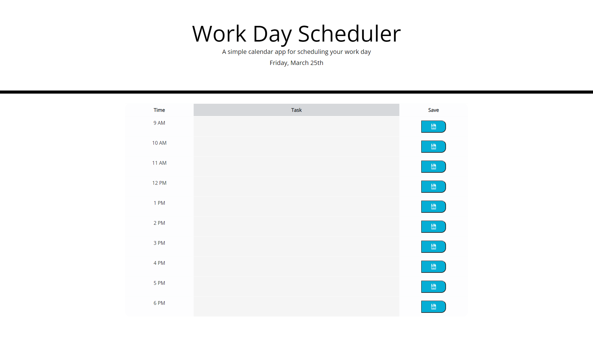

# ADayPlanner

## GitHub Deployed Page: https://simonasnap.github.io/ADayPlanner/

## Description:

A Work Day planner
 - Up top is the date, and also the day of the week
 - there is a table with a row for each hour of the work day (set from 9 - 6)
 - each row has the hour, a task section and a save button
 - the task section will change color according to the day (gray = past, red = present, green = future)
 - the user can select a task section to input a task, then click the save button to store that task
 - at the end of the day, when currentHour = 24, storage is cleared and ready for the new day

## What I learned:

I practiced working with for loops!
 - how to place and use moments in my js file
 - how to use moments to get the currentHour to then manipulate my code
    - for instance to change the background colors, and when to clear localStorage
 - how to make corresponding button and input forms through the use of i.toString() to set the changing id's for the different elements and then hooking them up through a function
 - how to set up and play with a table and some of its restrictions
    - there is also an insertcell option to create cells in the table - however, i didn't fully understand some of the explanations on how to style a particular section of the table, so i deferred to a process i did understand

## Screenshot of Deployed Page:

Copyright (c) 2022 Simona Snap

Permission is hereby granted, free of charge, to any person obtaining a copy of this software and associated documentation files (the "Software"), to deal in the Software without restriction, including without limitation the rights to use, copy, modify, merge, publish, distribute, sublicense, and/or sell copies of the Software, and to permit persons to whom the Software is furnished to do so, subject to the following conditions:

The above copyright notice and this permission notice shall be included in all copies or substantial portions of the Software.

THE SOFTWARE IS PROVIDED "AS IS", WITHOUT WARRANTY OF ANY KIND, EXPRESS OR IMPLIED, INCLUDING BUT NOT LIMITED TO THE WARRANTIES OF MERCHANTABILITY, FITNESS FOR A PARTICULAR PURPOSE AND NONINFRINGEMENT. IN NO EVENT SHALL THE AUTHORS OR COPYRIGHT HOLDERS BE LIABLE FOR ANY CLAIM, DAMAGES OR OTHER LIABILITY, WHETHER IN AN ACTION OF CONTRACT, TORT OR OTHERWISE, ARISING FROM, OUT OF OR IN CONNECTION WITH THE SOFTWARE OR THE USE OR OTHER DEALINGS IN THE SOFTWARE.